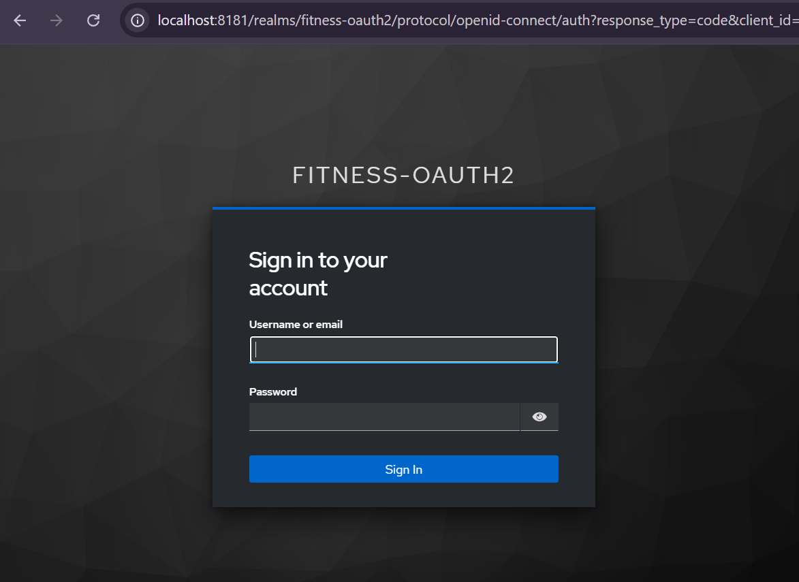
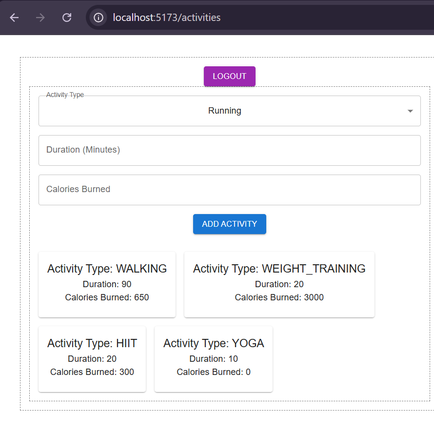
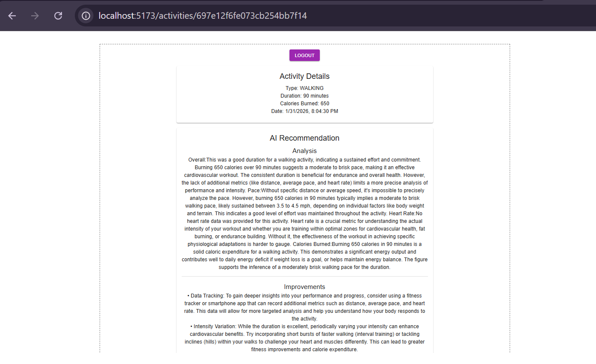

## 🏋️‍♂️ Fitness Microservices Platform

An **end-to-end fitness tracking platform** built using **Spring Boot microservices** and **React**, featuring secure OAuth2 authentication, event-driven communication, and AI-powered fitness recommendations.

This project is designed to demonstrate **real-world microservices architecture patterns**, not just CRUD services.

---

## ✨ Key Features

* 🔐 **OAuth 2.0 + PKCE authentication** using Keycloak
* 🌐 **API Gateway–based security** and routing
* 🧭 **Service discovery** with Eureka
* 📡 **Event-driven architecture** using RabbitMQ
* 🗄 **Polyglot persistence** (PostgreSQL + MongoDB)
* 🤖 **AI-powered recommendations** using Google Gemini
* ⚙️ **One-command local startup** with automation scripts

---

## 📌 High-Level Architecture

```
React Frontend
      ↓
API Gateway (JWT validation)
      ↓
Eureka Service Discovery
      ↓
------------------------------------------------
| User Service | Activity Service | AI Service |
| PostgreSQL   | MongoDB          | MongoDB    |
------------------------------------------------
                    ↓
               RabbitMQ Events
                    ↓
             Google Gemini API
```

---

## ⚡ Quick Start (Recommended)

### 🔧 Prerequisites

* Java 21
* Maven
* Node.js 18+
* Docker & Docker Compose

---

## ▶️ Start the Entire Platform

From the project root:

```bat
start-all.bat
```

### What this script does

* Starts **Keycloak** and **RabbitMQ** using Docker
* Starts all backend services in correct order:

  * Eureka Server
  * Config Server
  * User Service
  * Activity Service
  * AI Service
  * API Gateway
* Starts the **React frontend**
* Waits for each service to be available before proceeding

### 🌐 Access URLs

* Frontend → [http://localhost:5173](http://localhost:5173)
* API Gateway → [http://localhost:8080](http://localhost:8080)
* Eureka Dashboard → [http://localhost:8761](http://localhost:8761)
* Keycloak Admin → [http://localhost:8181](http://localhost:8181)

---

## 🛑 Stop the Platform

```bat
stop-all.bat
```

This stops:

* All Spring Boot services
* React frontend
* Docker containers (Keycloak, RabbitMQ)

---

## 🔑 Gemini API Configuration (Required)

The **AI Service depends on Google Gemini** and requires environment variables.

Before running `start-all.bat`, configure:

```bat
set GEMINI_API_URL=https://generativelanguage.googleapis.com/v1beta/models/gemini-2.5-flash:generateContent?key=
set GEMINI_API_KEY=YOUR_REAL_API_KEY_HERE
```

⚠️ If these values are missing or invalid, the AI Service will fail at startup.

Generate your API key from:
👉 [https://aistudio.google.com/api-keys](https://aistudio.google.com/api-keys)

---

## 🔐 Authentication & Authorization (Keycloak)

This platform uses **Keycloak** as the OAuth 2.0 / OpenID Connect provider.

* Authorization Code Flow with **PKCE (S256)**
* JWT validation enforced at the **API Gateway**
* Downstream services are never exposed directly

---

## 🧱 Keycloak One-Time Setup

**Required only on first run**

### 1️⃣ Start Keycloak

Admin Console:
[http://localhost:8181](http://localhost:8181)
Username: `admin`
Password: `admin`

---

### 2️⃣ Realm Configuration

* Realm Name: `fitness-oauth2`
* Realm Enabled: ✅

---

### 3️⃣ Client Configuration (PKCE)

| Setting               | Value                |
| --------------------- | -------------------- |
| Client ID             | `oauth2-pkce-client` |
| Client Type           | OpenID Connect       |
| Client Authentication | OFF                  |
| Standard Flow         | ✅                    |
| Direct Access Grants  | ✅                    |
| PKCE Method           | S256                 |

Redirect URI:

```
http://localhost:5173
```

---

### 4️⃣ Issuer URI

From OpenID configuration:

```
http://localhost:8181/realms/fitness-oauth2
```

Used by API Gateway for JWT validation.

---

## 🧩 Microservices Overview

### 🧭 Eureka Server

* Port: `8761`
* Central service registry

### 🌐 API Gateway

* Port: `8080`
* JWT validation
* Route-based service access

### 👤 User Service

* Port: `8081`
* PostgreSQL
* User validation APIs

### 🏃 Activity Service

* Port: `8082`
* MongoDB
* Publishes activity events

### 🤖 AI Service

* Port: `8083`
* MongoDB
* Consumes RabbitMQ events
* Generates AI recommendations

---

## 🗄 Database Configuration

### PostgreSQL

```
Database: fitness_user_db
Username: postgres
Password: postgres
```

### MongoDB

```
mongodb://localhost:27017
Databases:
- fitnessactivity
- fitnessrecommendation
```

---

## 🐰 RabbitMQ

* Exchange: `fitness.exchange`
* Queue: `activity.queue`
* Routing Key: `activity.tracking`

UI: [http://localhost:15672](http://localhost:15672)
Username: `guest`
Password: `guest`

---

## 🌐 API Access (Gateway Only)

```
/api/users/**
/api/activities/**
/api/recommendations/**
```

---

## 🖥 Application Screenshots

### 🔐 Authentication (Keycloak PKCE)


### 🏃 Activity Tracking Dashboard


### 🤖 AI-Powered Recommendation


---

## 👨‍💻 Author

Built as part of a **hands-on microservices learning journey**, focusing on:

* real authentication flows
* distributed systems
* event-driven architecture
* AI integration
